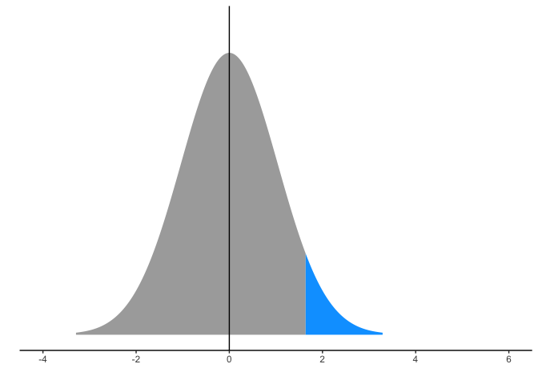
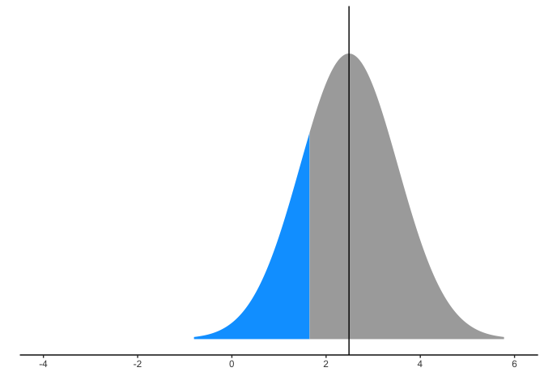
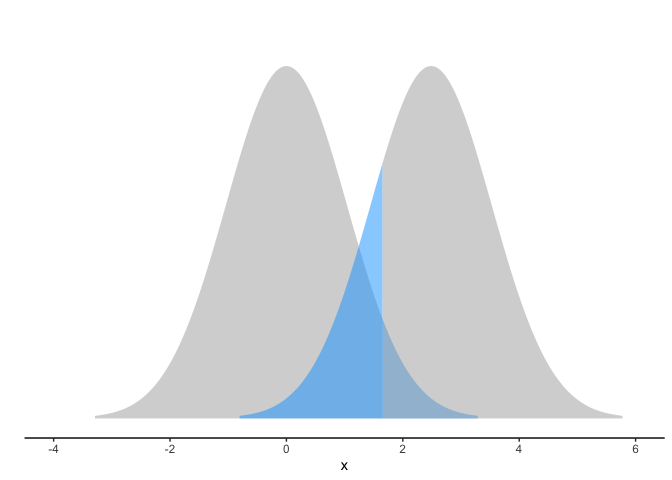
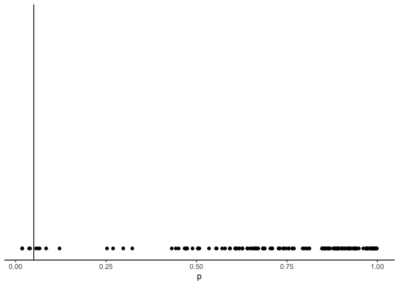
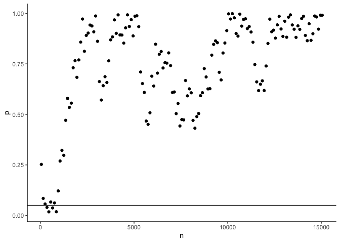
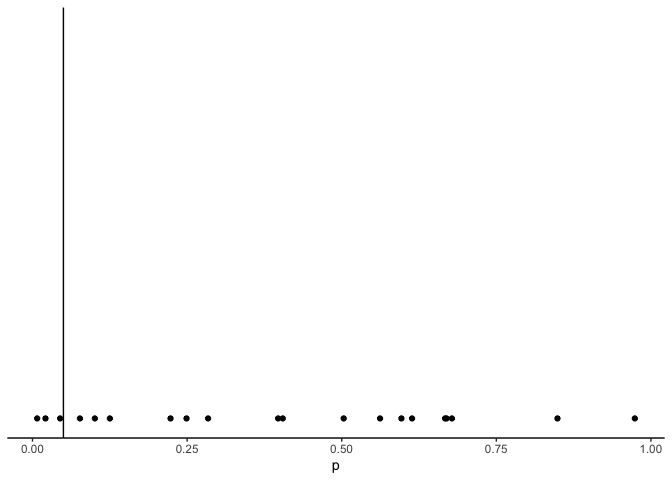
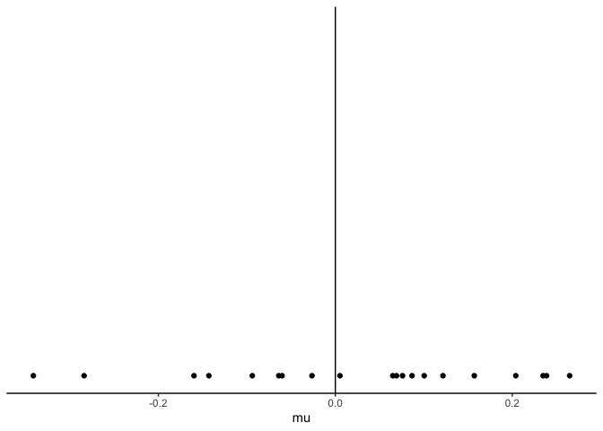

This document includes the code for generating the figures in the
lecture.

# Setup

``` r
library(tidyverse) # tibble
```

    ## ── Attaching core tidyverse packages ──────────────────────── tidyverse 2.0.0 ──
    ## ✔ dplyr     1.1.4     ✔ readr     2.1.5
    ## ✔ forcats   1.0.0     ✔ stringr   1.5.1
    ## ✔ ggplot2   3.5.1     ✔ tibble    3.2.1
    ## ✔ lubridate 1.9.3     ✔ tidyr     1.3.1
    ## ✔ purrr     1.0.2     
    ## ── Conflicts ────────────────────────────────────────── tidyverse_conflicts() ──
    ## ✖ dplyr::filter() masks stats::filter()
    ## ✖ dplyr::lag()    masks stats::lag()
    ## ℹ Use the conflicted package (<http://conflicted.r-lib.org/>) to force all conflicts to become errors

``` r
library(ggdist) # plot distributions

SD = 1 # assume a standard deviation of 1
```

# Fisher

In Fisher’s approach, we draw a normal distribution and highlight the 5%
of the right tail.

``` r
# sample from the distribution
data = tibble(x = qnorm(ppoints(1000), mean = 0, sd = SD))
# determine where the point is
p95 = qnorm(.95, mean = 0, sd = 1)
```

``` r
data %>% 
  ggplot(aes(x = x)) +
  stat_slab(aes(fill = after_stat(x > p95))) +
  theme_classic() + 
  scale_y_continuous(expand = c(0,0), breaks = NULL) + 
  scale_fill_manual(values=c('#dddddd', '#00A2FF')) + 
  ylab('') 
```


# Neyman-Pearson

In Neyman-Pearson’s approach, we need to first determine alpha and beta
(1 - power). Usually, .8 is high power. .9 or above is very large and
may need a very large sample.

``` r
alpha =.05
power = 0.8
```

For plotting purposes, we use a standard deviation of 1. However, this
should be estimated from the data we later collected.

We assume the H_main has a mean of 0. Then we calculate the other
distribution.

``` r
qnorm(p = 1 - power, lower.tail = FALSE, sd = SD)
```

    ## [1] 0.8416212

``` r
mean2 = qnorm(p = alpha, lower.tail = FALSE, sd = SD) + qnorm(p = 1 - power, lower.tail = FALSE, sd = SD)
pnorm(q = qnorm(p = 1 - power, lower.tail = FALSE), mean=mean2, sd = SD)
```

    ## [1] 0.05

``` r
mean2
```

    ## [1] 2.486475

Draw some samples

``` r
data2 = tibble(x = qnorm(ppoints(1000), mean = mean2, sd = SD),
               dist = rep('HA', 1000))

data1 = tibble(x = qnorm(ppoints(1000), mean = 0, sd = SD),
               dist = rep('HM', 1000))
```

The distribution in the main hypothesis.

``` r
  ggplot() +
  stat_slab(data = data1, mapping = aes(x = x, fill = after_stat(x > qnorm(.05, lower.tail = FALSE, sd = SD)))) +
  theme_classic() + 
  geom_vline(xintercept = 0) + 
  scale_y_continuous(breaks = NULL) + 
  scale_x_continuous(limits = c(-4, 6)) +
  scale_fill_manual(values=c('#aaaaaa', '#00A2FF')) + 
  ylab('') + xlab('') + theme(legend.position = 'none') 
```



The distribution in the alternative hypothesis.

``` r
  ggplot() +
  stat_slab(data = data2, mapping = aes(x = x, fill = after_stat(x < qnorm(.2, lower.tail = TRUE, mean = mean2, sd = SD)))) +
   geom_vline(xintercept = mean2) + 
  theme_classic() + 
  scale_y_continuous(breaks =NULL) + 
  scale_x_continuous(limits = c(-4, 6)) +
  scale_fill_manual(values = c('#aaaaaa', '#00A2FF')) + 
  ylab('') + xlab('') + theme(legend.position = 'none') 
```



Put them together

``` r
  ggplot() +
  stat_slab(data = data1, mapping = aes(x = x, fill = after_stat(x > qnorm(.05, lower.tail = FALSE, sd = SD))), alpha = .5) +
  stat_slab(data = data2, mapping = aes(x = x, fill = after_stat(x < qnorm(.2, lower.tail = TRUE, mean = mean2, sd = SD))), alpha = .5) +
  theme_classic() + 
  scale_y_continuous(breaks =NULL) + 
  scale_x_continuous(limits = c(-4, 6)) + 
  scale_fill_manual(values = c('#aaaaaa', '#00A2FF')) + 
  ylab('') + theme(legend.position = 'none')
```



# P dance

First, we show what happen if we increase the sample size

``` r
set.seed(12345) # for reproducibility
samples = rnorm(15000, mean = 0, sd = 1) # draw lots of samples
```

``` r
head(samples)
```

    ## [1]  0.5855288  0.7094660 -0.1093033 -0.4534972  0.6058875 -1.8179560

We write a loop to show p values under different sample sizes.

``` r
n = 50 # start with 50
pvalues = c() # a container
ns = c()
repeat{
  test = t.test(samples[1:n]) 
  pvalues = c(pvalues, test$p.value) # t-test, compare to 0
  ns = c(ns, n)
  if(n > length(samples))
    break
  n = n+100
}
```

``` r
pvalues
```

    ##   [1] 0.25252205 0.08419887 0.05645780 0.03976305 0.01777029 0.06619174
    ##   [7] 0.03725079 0.06191777 0.01833337 0.12125453 0.26925549 0.32232881
    ##  [13] 0.29747320 0.47056226 0.57894307 0.53448140 0.55571492 0.73045451
    ##  [19] 0.76544362 0.68329633 0.76950095 0.85766198 0.97190054 0.81214514
    ##  [25] 0.89056199 0.90242359 0.94211893 0.93747923 0.90839953 0.98699564
    ##  [31] 0.86163073 0.66244523 0.57097856 0.64198411 0.68665199 0.65779459
    ##  [37] 0.76503729 0.86889526 0.88370592 0.96767080 0.90119016 0.99242348
    ##  [43] 0.89301729 0.89258651 0.85271796 0.92812826 0.99263052 0.93483782
    ##  [49] 0.96888640 0.88845006 0.98611159 0.98777002 0.93399238 0.70973843
    ##  [55] 0.65256702 0.60866660 0.46710487 0.45054873 0.50792525 0.68892064
    ##  [61] 0.64034719 0.84724220 0.70414753 0.79761809 0.81111509 0.72954682
    ##  [67] 0.75573502 0.75369409 0.80433107 0.74146021 0.60830533 0.61096725
    ##  [73] 0.50375224 0.55390455 0.44277255 0.47434736 0.47268099 0.66749028
    ##  [79] 0.59181048 0.62638940 0.60686181 0.47032142 0.43164127 0.48893791
    ##  [85] 0.50404522 0.59281731 0.60748922 0.72649760 0.68515063 0.62606250
    ##  [91] 0.62727537 0.79329170 0.84652554 0.86395947 0.85498949 0.70811702
    ##  [97] 0.67064404 0.80390726 0.85326412 0.91443456 0.99755469 0.97188025
    ## [103] 0.99869741 0.97789154 0.90056580 0.88728164 0.99616660 0.93674986
    ## [109] 0.96989086 0.97313835 0.92443557 0.93443099 0.90756677 0.85694995
    ## [115] 0.74658553 0.66096354 0.61770873 0.64914176 0.66609752 0.61822480
    ## [121] 0.73939033 0.85106783 0.97148294 0.90902318 0.91677343 0.87748191
    ## [127] 0.94303804 0.98513259 0.92248400 0.88589215 0.96091899 0.88175938
    ## [133] 0.98103013 0.99253584 0.94250172 0.92139087 0.88109977 0.93805588
    ## [139] 0.92080340 0.97435741 0.98545213 0.89062127 0.86463671 0.94876168
    ## [145] 0.86633474 0.89922944 0.98684707 0.98212449 0.92180920 0.99100656
    ## [151] 0.99058719

``` r
ggplot(tibble(p=pvalues)) +
  theme_classic() + 
  geom_point(aes(x=p), y=0) +
  geom_vline(xintercept=0.05) 
```



``` r
ggplot(tibble(p=pvalues, n = ns)) +
  theme_classic() + 
  geom_point(aes(y=p, x=n)) +
  geom_hline(yintercept=0.05) 
```



Next, we show p values’s changes in repeated experiments

``` r
n = 50
pvalues = c()
means = c()

for(i in 1:20){
  set.seed(i) # for reproducibility
  samples = rnorm(n, mean = 0, sd = 1)
  means = c(means, mean(samples))
  test = t.test(samples) # t-test
  pvalues = c(pvalues, test$p.value) # store p values
}
```

``` r
pvalues
```

    ##  [1] 0.397085241 0.667089582 0.613750277 0.076697206 0.669336386 0.561997280
    ##  [7] 0.100805027 0.678159564 0.503181225 0.007579664 0.020994575 0.249053832
    ## [13] 0.848857704 0.125083913 0.044664855 0.223177021 0.596531930 0.973907807
    ## [19] 0.404662921 0.283896859

Plot p values in these repeated experiments

``` r
ggplot(tibble(p=pvalues)) +
  theme_classic() + 
  geom_point(aes(x=p), y=0) +
  geom_vline(xintercept=0.05)
```



Plot means in these repeated experiments

``` r
ggplot() +
  # stat_slab(data=tibble(x = qnorm(ppoints(1000), sd = .3)), mapping=aes(x=x), alpha = .5) + 
  theme_classic() + 
  geom_point(data=tibble(mu=means), mapping=aes(x=mu), y=0) +
  geom_vline(xintercept=0)
```


